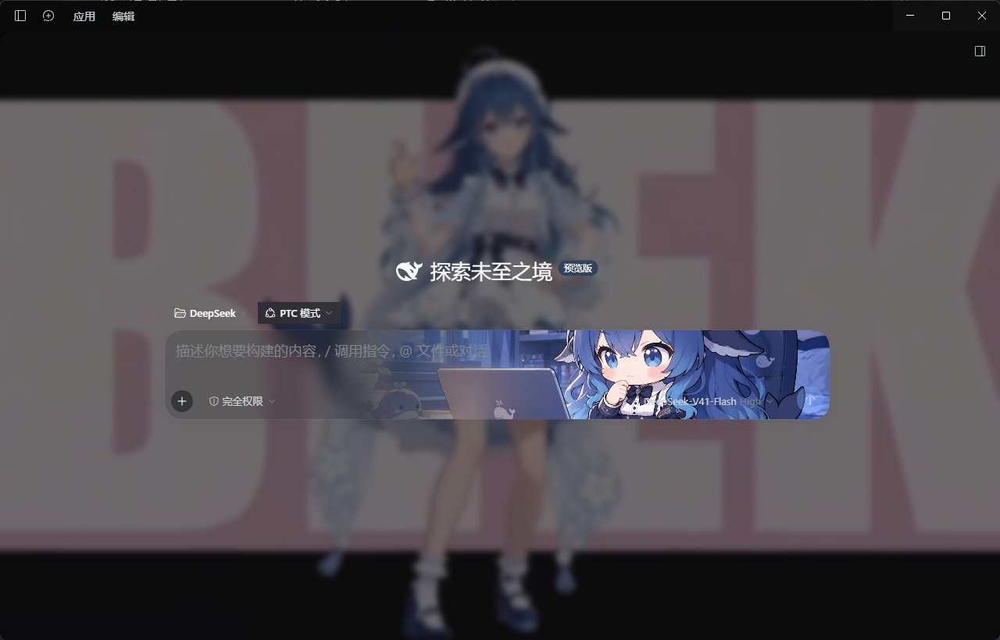
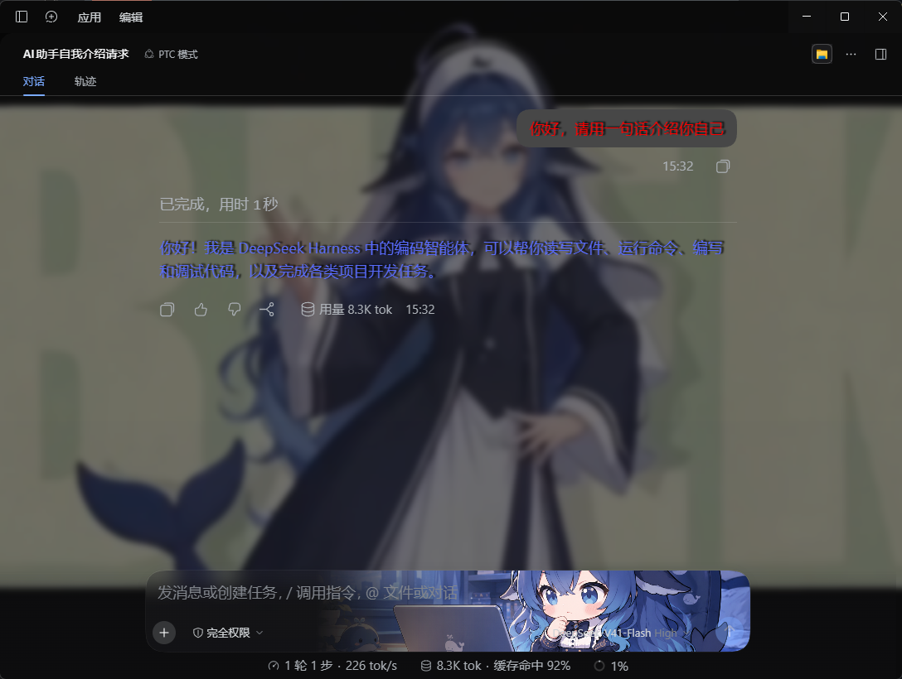

# dsh-skin-master · Skin Master

A **custom skin plugin** for the DeepSeek Harness (DSH) desktop app: global wallpaper (image / video), frosted-glass blur, chat-input background, popover surfaces, filters, AI reply text and user bubble colors.

> Extracted from the community-plugins module (`dsh-community-plugins`) of [DeepSeek-Harness-NB](https://github.com/Lzhimie/DeepSeek-Harness-NB), with the community plugin center stripped out. Released under the MIT license.

## Features

- **Background image / video** — URL or local file (uploads persist across restarts); cover / contain / repeat modes; video volume & mute.
- **Effects** — background blur, UI transparency, image scale.
- **Filters** — brightness / contrast / saturation.
- **Input background** — an image on the chat input card: 6 modes (fill / fit / stretch / tile / center / span), gradient transition position, drag-to-position preview, image blur / opacity / scale; independent frosted input-card transparency.
- **Popover background** — opacity / blur / grain for command menus, pickers, overlays.
- **My messages** — bubble color, text color, opacity, blur.
- **AI reply text** — custom color.
- **Chat typography** — bold and text shadow for AI replies / my messages, each toggled separately; bold weight (400–900) and shadow strength (0–100%) sliders with a live preview.
- All settings apply live and persist on disk across restarts.

## Screenshot



*Reference: DeepSeek Harness desktop — video wallpaper + frosted-glass blur + chat input background, in action.*



*Reference: chat typography — bold colored AI replies, user bubble color + input background, in action.*

## Install

**Option A — Community plugin center (recommended):** search `dsh-skin-master` in the DSH desktop community plugin center, install, restart the app.

**Option B — One-line prompt to the built-in AI (zero terminal, recommended for beginners):** copy the whole block below (use the copy button at the block's top-right) and send it to the AI inside DeepSeek Harness — it will install the plugin for you:

```text
Please install the DeepSeek Harness skin plugin dsh-skin-master for me:
1. Run `dsh plugin --profile desktop add "github:Lzhimie/dsh-skin-master"`. If the dsh command is not found, use the full path to dsh.cmd under the Harness install dir (resources/runtime/cli/bin/). If the download fails, configure a system proxy and retry.
2. Edit ~/.dsh/profiles/desktop/cordis.patch.yml and append the following at the end:
   - insert:
       - id: skin-master
         name: dsh-skin-master
3. When done, remind me to restart DeepSeek Harness.
```

> The package is pulled from GitHub, so github.com must be reachable (use a proxy if needed). After restart, click the palette icon at the bottom of the sidebar to open "Skin Master".

**Option C — CLI / manual:**

```bash
dsh plugin --profile web add dsh-skin-master
```

or clone this repo and add to your profile's `cordis.patch.yml`:

```yaml
- insert:
    - id: skin-master
      name: dsh-skin-master
```

then restart DeepSeek Harness.

## Storage

- Settings: `<DSH home>/dsh-skin-master/skin.json`
- Uploaded assets: `<DSH home>/dsh-skin-master/assets/`

**Migration:** settings from the legacy `community-skin.json` (and the browser `dsc.skin` key) are inherited read-only — no re-configuration needed.

## License

MIT — Copyright (c) 2026 Lzhimie. Extracted from DeepSeek-Harness-NB (`dsh-community-plugins`, MIT).
